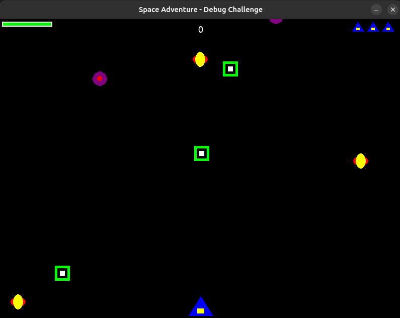
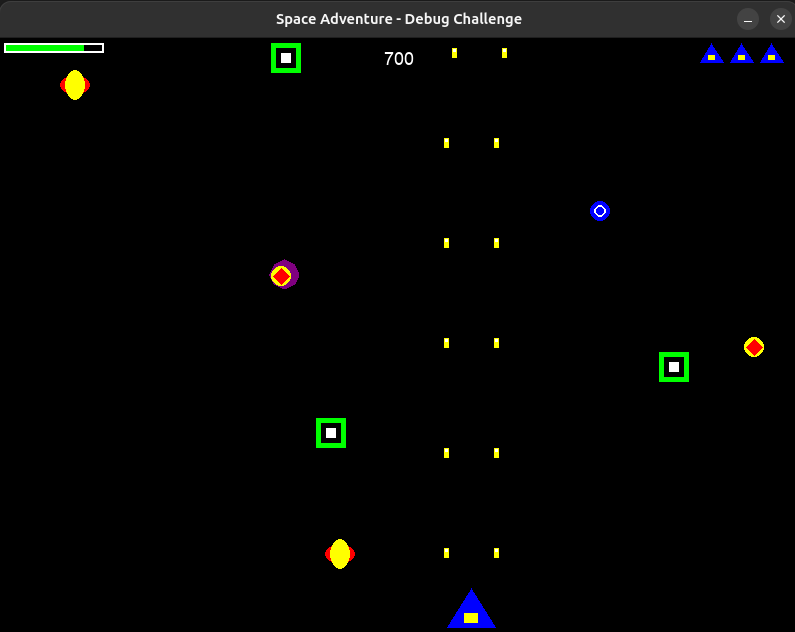

# 🚀 Space Adventure Game – Student Mission Guide

Welcome, Space Cadet! 🌟

You are about to embark on a journey to explore, play, and improve a classic space shooter game built with Python and Pygame. This guide will help you get started, understand the game, and show you how to make it even better. Ready to launch? Let’s go!

---

## 1. What is Pygame?

**Pygame** is a set of Python tools that make it easy to create games with graphics, sound, and user input. If you’ve never used Pygame before, don’t worry! You’ll learn as you play and fix the game.

---

## 2. Getting Started: Setup Checklist

### 🛠️ Step 1: Install the Requirements

1. Open your terminal (Command Prompt, PowerShell, or Terminal app).
2. Move to the game folder (You can see your current path in your terminal):
   ```bash
   cd /path/to/Space_shooting
   ```
3. Install all the required Python packages (including Pygame):
   ```bash
   pip install -r requirements.txt
   ```
   This will make sure everything you need is ready!

---

## 3. Running the Game

1. **Create the game sprites:** This will create all the sprites (images) you need for the game
   ```bash
   python create_sprites.py
   ```
   > **Want to know what each image or icon means?**
   > After creating the sprites, check out the [IMAGE_GUIDE.md](IMAGE_GUIDE.md) document for a fun visual guide to all the game graphics!
2. **Start the game:**
   ```bash
   python space_adventure.py
   ```
3. You should see a screen like this:

   

---

## 4. How to Play

- **Move Left:** Left Arrow Key
- **Move Right:** Right Arrow Key
- **Shoot:** Spacebar

Try playing the game and see how it works! If it doesn't work as you expect, then that could be a bug!!

---

## 5. Game Features & What to Expect

### 🚀 Player Ship
- Your ship appears at the bottom of the screen.
- You start with 3 lives.
- Your ship has a shield (shown as a bar at the top left).
- When your shield is gone, you lose a life.
- When all lives are lost, the game should end automatically (It will exit the game and close the window automatically)

### 👾 Enemies
- Enemy ships come from the top and move down.
- They can also move sideways.
- If an enemy reaches the bottom or goes too far to the sides, it should reappear at the top.

### 💥 Bullets
- Shoot bullets to destroy enemies.
- Bullets go up from your ship.
- Bullets fly at a reasonable speed.
- At power level 1, you shoot one bullet.
- At power level 2 or higher, you shoot two bullets at once.

### 🛡️ Power-ups
- **Shield Power-up:** Blue circle icon. Increases your shield by 20 (up to 100).
- **Power Power-up:** Yellow icon with a red pattern. Increases your power level.
- Power-ups disappear if they go off the bottom of the screen.
- Power level upgrades last for 5 seconds, then return to normal.

#### Example Power-up Display

When you collect a power-up, you should see something like this on the screen:



If you don’t see the power-up effects or icons as shown, there may be something to improve!

### 🏆 Scoring & Display
- Destroying an enemy gives you 100 points.
- Your score is shown at the top center.
- Shield bar is at the top left.
- Lives left are shown as small ship icons at the top right.

---

## 6. Developer’s Corner: What Could Go Wrong?

When developers create games, sometimes things are left in a test state or small mistakes are made. For example:
- The game might not end when all lives are lost.
- The shield or health might not decrease as expected.
- Power-ups might not work or display correctly.
- Enemies or bullets might not behave as described.
- Sometimes, values like + and - are mixed up, or things go out of bounds.

Yes, there are more things could go wrong. Your job is to play the game, notice anything that doesn’t match the descriptions above, and improve the code so everything works as intended.

---

## 7. How to Test Your Fixes (🚦 Auto-Magic Edition!)

After you fix the bugs, simply **commit your changes** (save your work to the project). The test cases will run automatically in the background—like magic! ✨

- If all tests pass, you’ve fixed the bugs correctly and your mission is a success! 🏅
- If any tests fail, something still needs to be fixed—review your changes and try again. Don’t worry, every great coder learns from mistakes!

**Tips for Success:**
- Don’t just change values to make tests pass. Make sure your fixes follow best practices, like correct indentation and spacing.
- Sometimes, the game might work, but the test will only pass if you fix the code properly!
- Since you are developing this as a team, code should be readable and you shouldn’t change the code structure or anything that isn’t necessary. That may cause test cases to fail.

---

## 8. Your Mission 🚩

- Play the game and explore all its features.
- Find anything that doesn’t work as described.
- Fix the code in `space_adventure.py` so the game matches the instructions.
- Commit your changes and raise PRs (pull requests) and let the auto-tests do their thing!
- You will recieve marks for each bug you are fixing.

If all tests pass, congratulations! You’ve made Space Adventure work perfectly. 🌟

---

Good luck, and have fun improving Space Adventure! 🚀

> "The best way to learn to code is to play, break, and fix. May your bugs be few and your fixes be legendary!" 🛸
